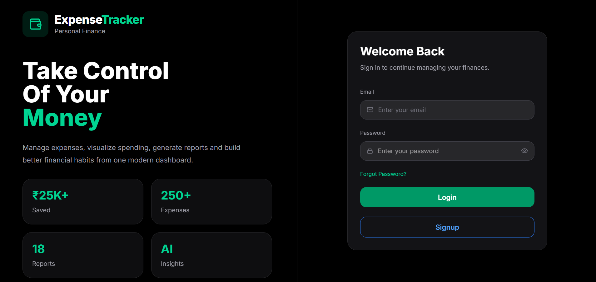
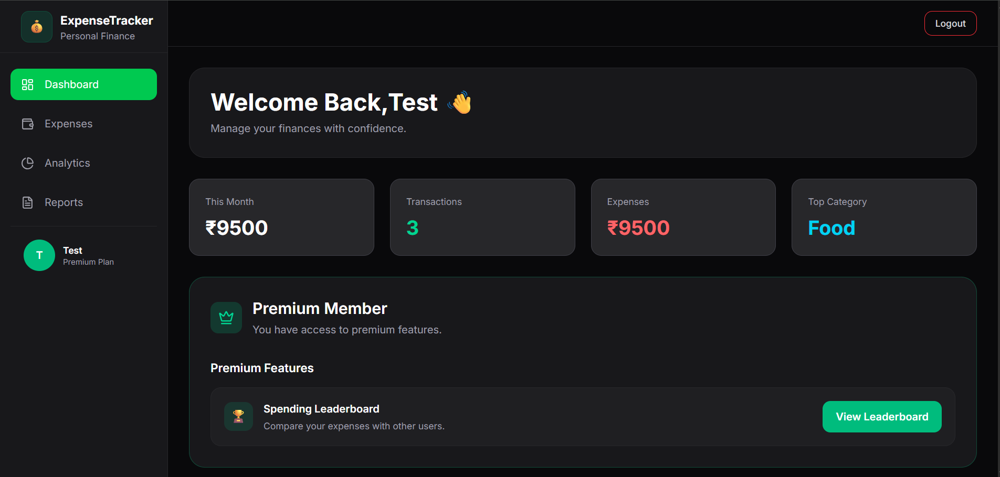
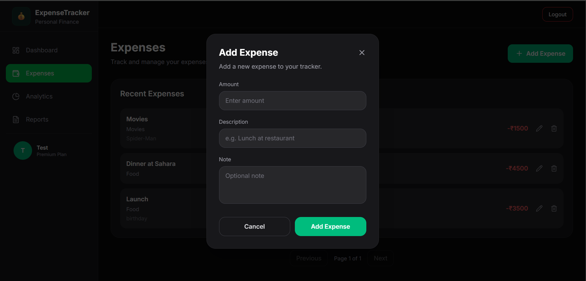
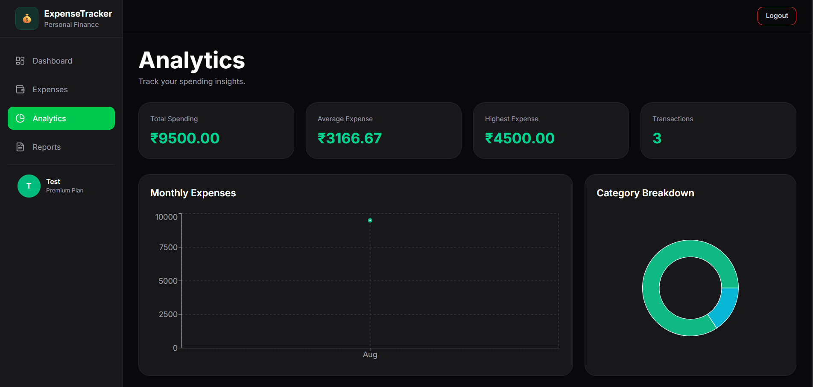
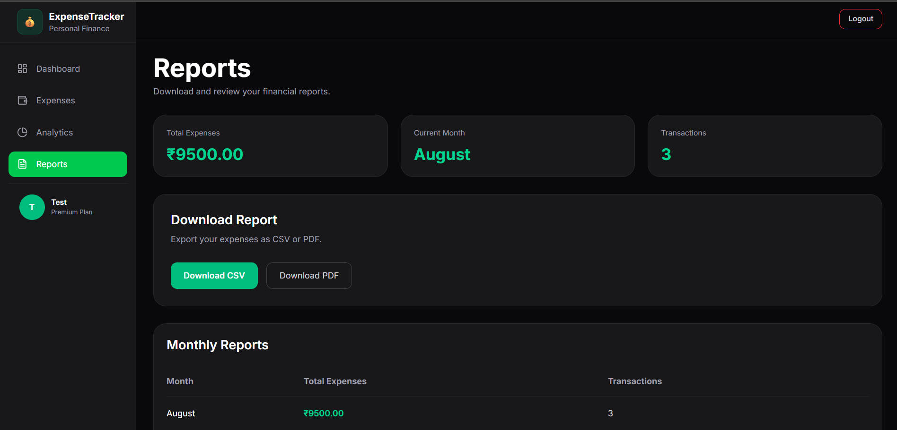
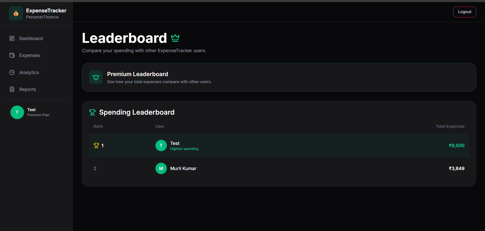
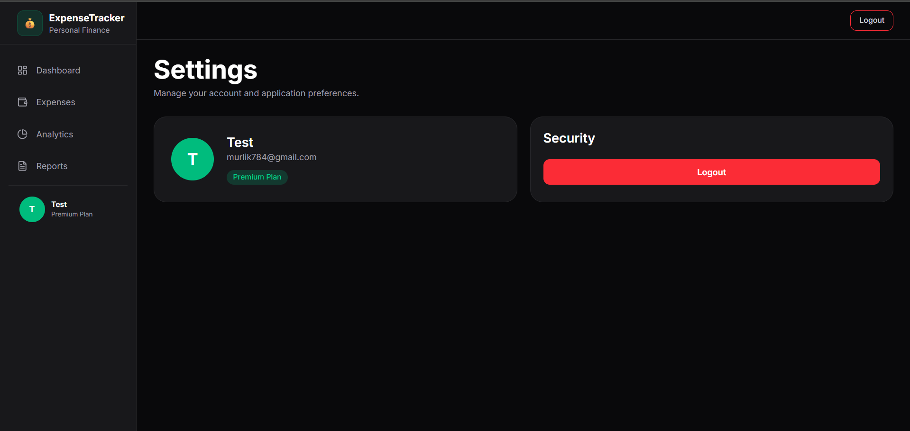

# 💰 Expense Tracker

A full-stack personal expense tracking application built to help users manage, analyze, and understand their spending.

The application includes **AI-powered expense categorization, interactive analytics, downloadable PDF reports, password recovery, premium membership, and a leaderboard system**.

Built with **React + Vite** on the frontend and **Node.js + Express + MongoDB** on the backend.

---

## 🌐 Live Demo


👉 **[Open Expense Tracker](https://expensetracker-frontend-kt50.onrender.com)**

---

## 📸 Screenshots

### 🔐 Login



### 📊 Dashboard



### 💸 Expense Management



### 📈 Analytics



### 📄 Monthly Reports



### 🏆 Premium Leaderboard



### ⚙️ Settings



> Screenshots showcase the responsive UI, dashboard, expense management, analytics, reports, premium features, and authentication flow.

---

## ✨ Features

- **Authentication**
  - Secure user registration and login
  - JWT-based authentication
  - Password hashing using bcrypt
  - Protected routes

- **Expense Management**
  - Add expenses
  - Edit expenses
  - Delete expenses
  - Filter and view expenses
  - Expense notes and categories

- **AI Expense Categorization**
  - Automatically categorizes expenses using Google's Gemini AI
  - Supported categories include:
    - Food
    - Fuel
    - Movies
    - Travel
    - Shopping
    - Bills
    - Entertainment
    - Other

- **Dashboard**
  - Total spending overview
  - Monthly spending statistics
  - Recent transactions
  - Category summaries

- **Analytics**
  - Spending breakdown by category
  - Monthly spending analysis
  - Interactive charts using Recharts

- **Reports**
  - Monthly expense summaries
  - Downloadable PDF reports
  - Tabular expense data
  - PDF generation using jsPDF

- **Password Recovery**
  - Forgot password functionality
  - Secure password reset flow
  - Transactional emails using Brevo

- **Premium Membership**
  - Premium membership purchase
  - Cashfree payment gateway integration
  - Premium-only features

- **Leaderboard**
  - Premium users can access the expense leaderboard
  - Spending-based user ranking

- **Responsive UI**
  - Responsive design for desktop, tablet, and mobile
  - Tailwind CSS
  - Lucide icons
  - Toast notifications

---

## 🛠️ Tech Stack

### Frontend

- React 19
- Vite
- React Router DOM
- Tailwind CSS
- Recharts
- React Hook Form
- Axios
- jsPDF
- jsPDF-AutoTable
- React Hot Toast
- Lucide React

### Backend

- Node.js
- Express 5
- MongoDB
- Mongoose
- JWT (`jsonwebtoken`)
- bcrypt
- Google Gemini AI (`@google/genai`)
- Cashfree Payment Gateway
- Brevo (`sib-api-v3-sdk`)
- Morgan
- Compression
- CORS

---

## 🏗️ Architecture

```text
                    ┌─────────────────────┐
                    │       User          │
                    └──────────┬──────────┘
                               │
                               ▼
                    ┌─────────────────────┐
                    │   React Frontend    │
                    │       + Vite        │
                    │    Tailwind CSS     │
                    └──────────┬──────────┘
                               │
                         REST API / Axios
                               │
                               ▼
                    ┌─────────────────────┐
                    │   Express Backend   │
                    │      Node.js        │
                    └──────────┬──────────┘
                               │
              ┌────────────────┼────────────────┐
              │                │                │
              ▼                ▼                ▼
       ┌────────────┐   ┌─────────────┐  ┌──────────────┐
       │  MongoDB   │   │ Gemini AI   │  │   Cashfree   │
       │  Database  │   │Categorization│ │   Payments   │
       └────────────┘   └─────────────┘  └──────────────┘
                               │
                               ▼
                         ┌────────────┐
                         │   Brevo    │
                         │   Emails   │
                         └────────────┘
